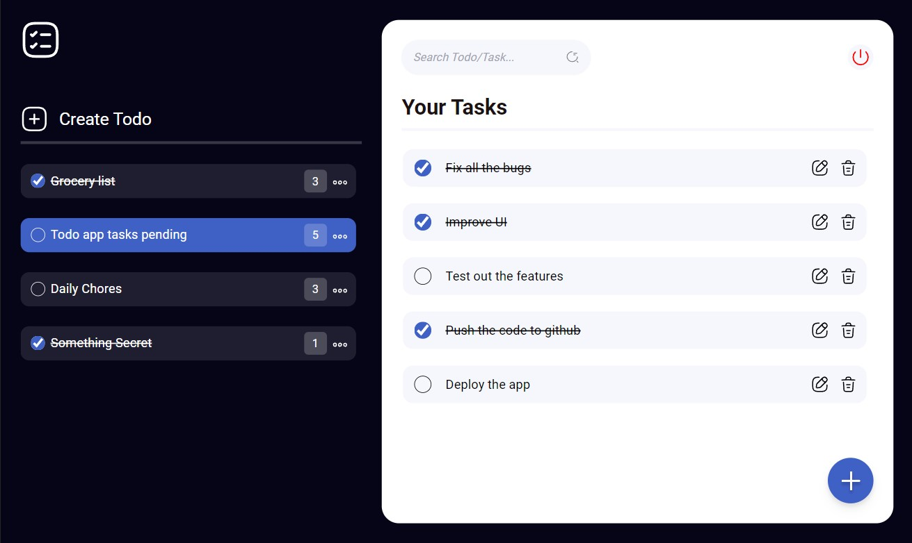
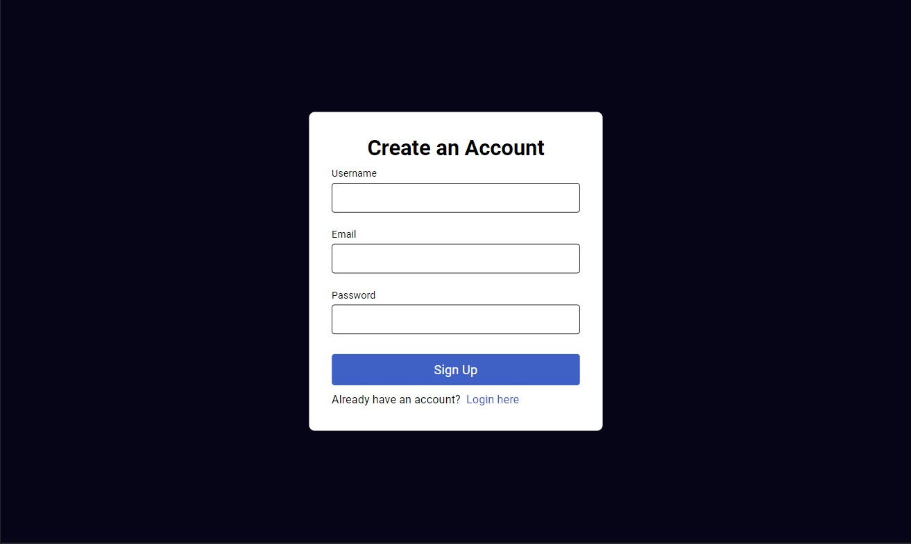

# 📄 Task List - MERN App

This is full stack MERN app to keep track of all your tasks. Now you can easily organize, manage and track your tasks.

## 🔗 Deployed Link

[
Live Link
](https://tasklist-mern.netlify.app/ "Live")

## ✨ Features

- Add/edit/remove todos
- Add/edit/remove tasks
- Search todos/tasks

## 📷 Sreenshots

## 👨🏻‍💻 Tech Used

### Frontend

### Backend

### Tools

### Hosting

